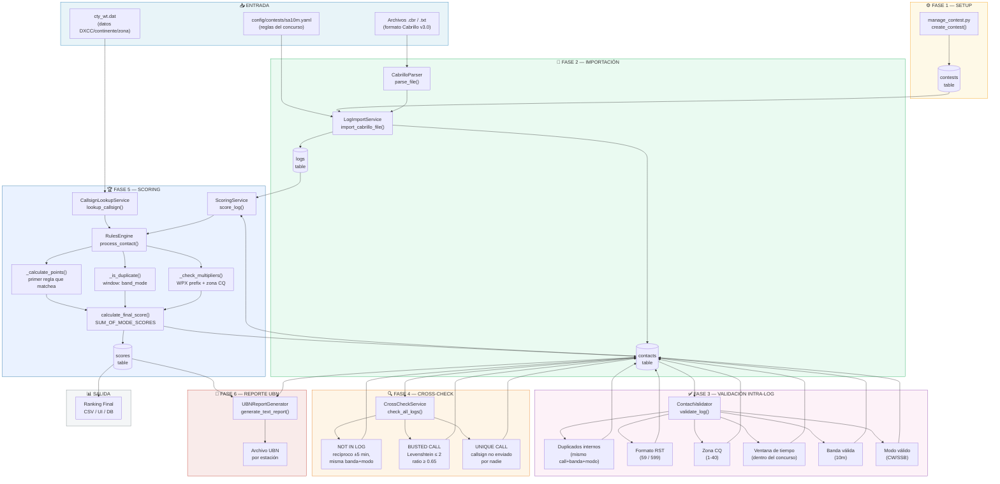
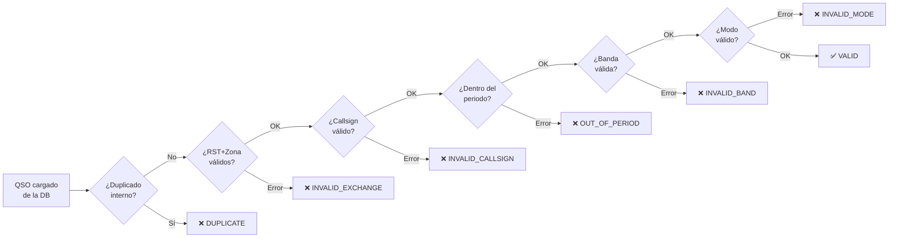
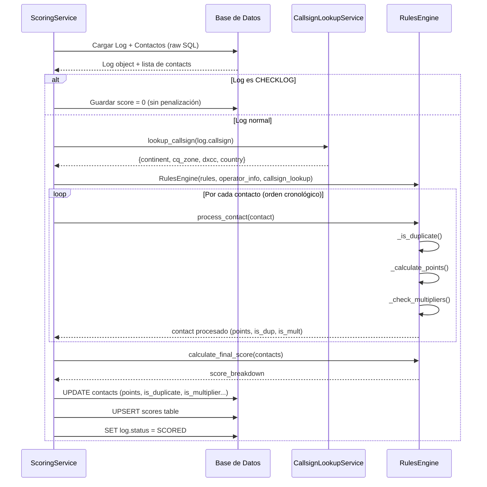
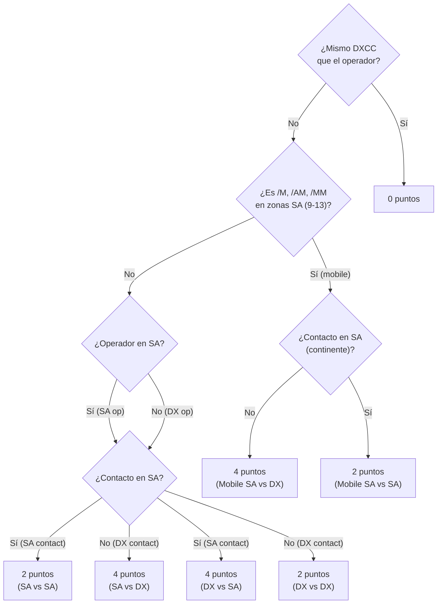

# Proceso Completo de Scoring — SA10M Contest Manager

## Tabla de Contenidos

1. [Visión General](#1-visión-general)
2. [Diagrama del Pipeline](#2-diagrama-del-pipeline)
3. [Fase 1 — Configuración del Concurso](#3-fase-1--configuración-del-concurso)
4. [Fase 2 — Importación de Logs](#4-fase-2--importación-de-logs)
5. [Fase 3 — Validación Intra-Log](#5-fase-3--validación-intra-log)
6. [Fase 4 — Cross-Check Inter-Log](#6-fase-4--cross-check-inter-log)
7. [Fase 5 — Scoring (Puntuación)](#7-fase-5--scoring-puntuación)
8. [Fase 6 — Reportes UBN](#8-fase-6--reportes-ubn)
9. [Reglas del SA10M en Detalle](#9-reglas-del-sa10m-en-detalle)
10. [Esquema de Base de Datos](#10-esquema-de-base-de-datos)
11. [Referencia de Estados](#11-referencia-de-estados)

---

## 1. Visión General

El sistema SA10M Contest Manager procesa logs de radioaficionados enviados en formato **Cabrillo v3.0** y produce un ranking final. El proceso se divide en **6 fases secuenciales**:

```
SETUP → IMPORTACIÓN → VALIDACIÓN → CROSS-CHECK → SCORING → REPORTE
```

Cada fase enriquece la base de datos SQLite con resultados parciales. El scoring final sólo se calcula **después** del cross-check, ya que los contactos inválidos (NIL, BUSTED, UNIQUE) afectan la puntuación.

### Módulos principales involucrados

| Módulo | Archivo | Rol |
|---|---|---|
| `manage_contest.py` | Raíz del proyecto | Crea/gestiona registros de concurso |
| `import_logs.py` / `import_all.py` | Raíz | CLI de importación |
| `CabrilloParser` | `src/parsers/cabrillo.py` | Parsea archivos .cbr/.txt |
| `LogImportService` | `src/services/log_import_service.py` | Persiste logs en DB |
| `ContactValidator` | `src/core/validation/contact_validator.py` | Validación intra-log |
| `CrossCheckService` | `src/services/cross_check_service.py` | Validación inter-log |
| `ScoringService` | `src/services/scoring_service.py` | Orquestador de puntuación |
| `RulesEngine` | `src/core/rules/rules_engine.py` | Motor de reglas |
| `CallsignLookupService` | `src/services/callsign_lookup.py` | Búsqueda DXCC/continente/zona |
| `UBNReportGenerator` | `src/services/ubn_report_generator.py` | Generación de reportes UBN |

---

## 2. Diagrama del Pipeline



---

## 3. Fase 1 — Configuración del Concurso

**Archivo:** `manage_contest.py`

El primer paso es registrar el concurso en la base de datos.

```bash
python manage_contest.py create \
    --name "SA10M 2026" \
    --slug "sa10m_2026" \
    --start "2026-03-14 00:00:00" \
    --end "2026-03-15 23:59:59" \
    --rules "sa10m"
```

Esto inserta una fila en la tabla `contests`:

```sql
INSERT INTO contests (name, slug, start_date, end_date, rules_file)
VALUES ('SA10M 2026', 'sa10m_2026', '2026-03-14', '2026-03-15', 'sa10m');
```

Las **reglas** (`rules_file`) apuntan a `config/contests/sa10m.yaml`, que contiene todas las definiciones de puntuación, multiplicadores, bandas y modos válidos.

---

## 4. Fase 2 — Importación de Logs

**Archivo:** `src/services/log_import_service.py`, `src/parsers/cabrillo.py`

### 4.1 Parsing del archivo Cabrillo

`CabrilloParser.parse_file(file_path)` procesa el archivo línea por línea:

- **Cabeceras** (`TAG: VALUE`): callsign, categoría, modo operativo, potencia, operadores, nombre, dirección, grid locator, email, claimed score.
- **QSOs** (`QSO: freq modo fecha hora callsign_env RST_env exch_env callsign_rcb RST_rcb exch_rcb`): cada QSO se convierte en un objeto `CabrilloQSO`.

**Detección de codificación:** El parser intenta UTF-8 → latin-1 → cp1252 → reemplazo de caracteres desconocidos, para manejar archivos de distintos softwares de log.

### 4.2 Persistencia en la base de datos

`LogImportService.import_cabrillo_file()` realiza:

1. **Verificar versionado**: Si ya existe un log del mismo callsign en el mismo concurso, compara la fecha de modificación del archivo. Si la nueva versión es más reciente, **elimina el log anterior** y sus contactos.
2. **Insertar Log**: Crea un registro en la tabla `logs` con todos los campos de la cabecera Cabrillo. Estado inicial: `VALIDATED`.
3. **Insertar Contactos**: Inserta todos los QSOs en batch en la tabla `contacts`. Por cada contacto:
   - Deriva la **banda** a partir de la frecuencia (ej. 28.000–29.999 kHz → `10m`).
   - Si el QSO tiene un `validation_reason` del parser → `validation_status = invalid_exchange`.

### 4.3 Campos derivados al importar

| Campo calculado | Origen |
|---|---|
| `band` | Frecuencia → tabla de rangos de frecuencia |
| `qso_datetime` | `qso_date` + `qso_time` combinados |
| `validation_status` | `invalid_exchange` si el parser detectó error en el intercambio |

---

## 5. Fase 3 — Validación Intra-Log

**Archivo:** `src/core/validation/contact_validator.py`

`ContactValidator.validate_log(log_id, contest_start, contest_end)` ejecuta **6 verificaciones** en orden sobre cada QSO del log, marcando su `validation_status` en la base de datos.

### Verificaciones aplicadas



### Detalle de cada verificación

| N° | Verificación | Criterio de Fallo | Estado Resultante |
|---|---|---|---|
| 1 | **Duplicado** | `(call_received, banda, modo)` ya visto en el mismo log | `DUPLICATE` |
| 2 | **Intercambio** | RST no cumple regex `5[1-9]\|59` (SSB) o `5[1-9][1-9]\|599` (CW); zona CQ fuera de rango 1–40 | `INVALID_EXCHANGE` |
| 3 | **Callsign** | No cumple regex estándar de indicativo | `INVALID_CALLSIGN` |
| 4 | **Periodo** | `qso_datetime` antes de `contest_start` o después de `contest_end` | `OUT_OF_PERIOD` |
| 5 | **Banda** | `band` no está en la lista de bandas del concurso (`10m`) | `INVALID_BAND` |
| 6 | **Modo** | `mode` no está en la lista de modos (`CW`, `SSB`) | `INVALID_MODE` |

Al finalizar, se actualiza en bulk la tabla `contacts`:
```sql
UPDATE contacts SET is_valid=?, is_duplicate=?, validation_status=?, validation_notes=?
WHERE id=?
```

---

## 6. Fase 4 — Cross-Check Inter-Log

**Archivo:** `src/services/cross_check_service.py`

El cross-check compara **todos los logs entre sí** para detectar discrepancias. Se ejecuta una sola vez, después de que todos los logs fueron importados.

```bash
python run_cross_check.py --contest-id 1
```

### Constantes del algoritmo

| Constante | Valor | Significado |
|---|---|---|
| `TIME_TOLERANCE_DAYS` | `0.003472` | ±5 minutos de tolerancia horaria |
| `LEVENSHTEIN_THRESHOLD` | `2` | Distancia máxima Levenshtein para BUSTED |
| `LEVENSHTEIN_MIN_RATIO` | `0.65` | Ratio mínimo de similitud |

### Tres tipos de errores detectados

#### 6.1 NOT IN LOG (NIL)

Para cada contacto en el log de la estación A, se verifica que exista un contacto recíproco en el log de la estación B:

```
A trabajó B → ¿B tiene en su log un QSO con A?
Condiciones:   misma banda + mismo modo + diferencia horaria ≤ 5 min
```

Si el recíproco no existe → el contacto de A se marca como `NOT_IN_LOG`.

**Implementación:** Se carga toda la tabla `contacts` en memoria y se construye un hash map:
```python
hash_map[(call_received.upper(), band, mode)] → [lista de contactos]
```

#### 6.2 UNIQUE CALL

```
Si call_received ∉ conjunto_de_todos_los_callsigns_enviados → UNIQUE
```

Un "Unique Call" es un indicativo que nadie en el concurso afirma haber trabajado desde su propio lado. Es altamente probable que sea un error de copia.

#### 6.3 BUSTED CALL

Para cada contacto cuyo `call_received` no está en el conjunto de callsigns enviados, se calcula la distancia Levenshtein con todos los callsigns enviados:

```python
distancia = levenshtein(call_logged, call_real)
ratio = similitud(call_logged, call_real)

if distancia <= 2 and ratio >= 0.65:
    → BUSTED (posible indicativo correcto: call_real)
```

### Resultado del cross-check

```
CrossCheckService.check_all_logs() → Dict[log_id, List[UBNEntry]]
```

Cada `UBNEntry` contiene: `contact_id`, `log_id`, `log_callsign`, `worked_callsign`, `ubn_type` (NIL/BUSTED/UNIQUE), y campos de intercambio.

`update_database_with_results()` actualiza la tabla `contacts`:
```sql
UPDATE contacts SET validation_status = 'not_in_log' WHERE id = ?
UPDATE contacts SET validation_status = 'busted_call' WHERE id = ?
UPDATE contacts SET validation_status = 'unique_call' WHERE id = ?
```

Luego, automáticamente se re-puntúan todos los logs afectados.

---

## 7. Fase 5 — Scoring (Puntuación)

**Archivo:** `src/services/scoring_service.py`, `src/core/rules/rules_engine.py`

Esta es la fase central. Se ejecuta por log, y se puede re-ejecutar en cualquier momento.

### 7.1 Flujo de `ScoringService.score_log(log_id)`



### 7.2 Información del operador

`CallsignLookupService.lookup_callsign(callsign)` realiza una búsqueda progresiva en la tabla `CTYData`:

```
Intenta matchear: 6 chars → 5 chars → 4 chars → 3 chars → 2 chars → 1 char
contra entity.prefixes en CTYData
```

Devuelve: `continent`, `cq_zone`, `country_name`, `dxcc_code`.

### 7.3 Motor de Reglas — `RulesEngine`

El motor mantiene **estado acumulado** durante el scoring de un log:

```python
worked_calls:               Dict[callsign, List[Contact]]   # historial de contactos
worked_prefixes_per_band_mode: Dict[(band,mode), Set[str]]  # prefijos WPX trabajados
worked_zones_per_band_mode:    Dict[(band,mode), Set[str]]  # zonas CQ trabajadas
```

#### 7.3.1 Detección de Duplicados — `_is_duplicate()`

Para el SA10M la ventana es `band_mode`:

```python
if callsign in worked_calls:
    for prev in worked_calls[callsign]:
        if prev.band == contact.band and prev.mode == contact.mode:
            return True  # DUPLICADO
```

#### 7.3.2 Cálculo de Puntos — `_calculate_points()`

Las reglas se evalúan **en orden**. La **primera que se cumple** asigna los puntos:



**Evaluación de condiciones** (`_evaluate_condition`):

| Tipo de condición | Descripción |
|---|---|
| `same_dxcc` | El callsign del operador y el del contacto son del mismo DXCC |
| `different_dxcc` | Diferente DXCC |
| `operator_continent` | El continente del operador es (o no es, con `!`) el especificado |
| `contact_continent` | El continente del contacto — usa `_cached_continent` si está disponible |
| `operator_zone` | La zona CQ del operador está en la lista (soporta negación `!9,10,11`) |
| `callsign_suffix` | El indicativo del operador termina en `/M`, `/AM`, `/MM` |
| `contact_callsign_suffix` | El indicativo del contacto termina en `/M`, `/AM`, `/MM` |

#### 7.3.3 Verificación de Multiplicadores — `_check_multipliers()`

Se verifican dos tipos de multiplicadores, ambos `per_band_mode`:

**Prefijo WPX:** Se extrae el prefijo WPX del callsign del contacto. Ejemplos:
- `LU3DX` → `LU3`
- `9A3YT` → `9A3` (casos especiales: indicativos que empiezan con dígito)
- `CE1/DL5XX` → Se extrae del segmento más largo

Si el prefijo **no fue trabajado antes** en esa banda+modo → es un multiplicador nuevo.

**Zona CQ:** Si la zona CQ del contacto **no fue trabajada antes** en esa banda+modo → es un multiplicador nuevo.

```python
new_prefix = prefix not in worked_prefixes_per_band_mode[(band, mode)]
new_zone   = zone   not in worked_zones_per_band_mode[(band, mode)]
```

### 7.4 Cálculo del Puntaje Final — `calculate_final_score()`

La fórmula es `SUM_OF_MODE_SCORES`:

$$\text{Score Final} = \sum_{\text{modo} \in \{CW, SSB\}} \left( \text{puntos}_{modo} \times (\text{mults\_WPX}_{modo} + \text{mults\_zona}_{modo}) \right)$$

**Ejemplo:**

| Modo | Puntos | Mults WPX | Mults Zona | Sub-total |
|------|--------|-----------|------------|-----------|
| CW   | 120    | 15        | 8          | 120 × 23 = **2.760** |
| SSB  | 80     | 10        | 6          | 80 × 16 = **1.280** |
| **TOTAL** | | | | **4.040** |

El resultado se almacena en la tabla `scores` con el desglose completo por banda y modo.

### 7.5 Datos almacenados en la tabla `scores`

| Campo | Contenido |
|---|---|
| `total_qsos` | Total de QSOs en el log |
| `valid_qsos` | QSOs que suman puntos |
| `duplicate_qsos` | QSOs duplicados (0 puntos, no penalizan) |
| `invalid_qsos` | QSOs inválidos (exchange, callsign, etc.) |
| `not_in_log_qsos` | QSOs con NIL del cross-check |
| `total_points` | Suma de puntos de QSOs válidos |
| `multipliers` | Total de multiplicadores |
| `final_score` | Puntaje final según fórmula |
| `points_by_band` | JSON: `{"10m": 200}` |
| `qsos_by_band` | JSON: `{"10m": 85}` |
| `multipliers_by_band` | JSON: `{"10m": {"CW": 23, "SSB": 16}}` |
| `multipliers_list` | JSON: lista de todos los prefijos/zonas multiplicadores |

---

## 8. Fase 6 — Reportes UBN

**Archivo:** `src/services/ubn_report_generator.py`

Para cada estación se genera un reporte UBN (Unique, Busted, Not-in-log) en texto plano, que es el formato estándar de los concursos internacionales.

### Secciones del reporte

```
REPORTE UBN — CE3ABC — SA10M 2025
===================================

[Encabezado con callsign, fecha, concurso]

ESTADÍSTICAS:
  QSOs enviados:        85
  QSOs válidos:         78
  NIL (No In Log):       4
  BUSTED:                3
  UNIQUE:                0
  Duplicados internos:   2

NIL — CONTACTOS NO ENCONTRADOS EN EL LOG DEL OTRO:
  ... tabla de QSOs donde el otro no tiene el recíproco

BUSTED CALLS — INDICATIVOS COPIADOS INCORRECTAMENTE:
  ... QSO logged | callsign real sugerido | similitud

UNIQUE CALLS:
  ... callsigns que nadie en el concurso reporta haber trabajado

MULTIPLICADORES PERDIDOS:
  ... prefijos/zonas que ya no cuentan como mult por los errores anteriores

MULTIPLICADORES VÁLIDOS:
  ... lista de prefijos WPX y zonas CQ que suman

ERRORES INVERSOS — OTRO COPIÓ MAL ESTE CALLSIGN:
  ... estaciones que bustearon el callsign de esta estación
```

El reporte se guarda en `ubn_reports/{callsign}_{contest}.txt`.

---

## 9. Reglas del SA10M en Detalle

**Archivo:** `config/contests/sa10m.yaml`

### 9.1 Parámetros del concurso

| Parámetro | Valor |
|---|---|
| Banda | 10m (28 MHz) |
| Modos | CW, SSB |
| Duración | 24 horas |
| Intercambio | RST + Zona CQ |
| Ventana de duplicados | `band_mode` (misma banda Y modo) |

### 9.2 Tabla de puntuación completa

| Operador | Contacto | Condición adicional | Puntos |
|---|---|---|---|
| cualquiera | mismo DXCC | — | **0** |
| Mobile SA (`/M`, `/AM`, `/MM`) en zonas 9–13 | SA | — | **2** |
| Mobile SA en zonas 9–13 | DX (no SA) | — | **4** |
| Mobile no-SA (fuera 9–13) | SA | — | **4** |
| Mobile no-SA | no-SA | — | **2** |
| SA (no mobile) | SA | — | **2** |
| SA (no mobile) | DX | — | **4** |
| DX (no-SA, no mobile) | SA | — | **4** |
| DX (no-SA, no mobile) | DX | — | **2** |

> **SA** = Sudamérica (continente `SA` según datos CTY). Zonas CQ 9–13.

### 9.3 Multiplicadores

- **Prefijo WPX** por banda+modo: cada prefijo nuevo en ese modo vale 1 multiplicador
- **Zona CQ** por banda+modo: cada zona CQ nueva en ese modo vale 1 multiplicador

### 9.4 Fórmula final

$$\text{Score} = (P_{CW} \times M_{CW}) + (P_{SSB} \times M_{SSB})$$

Donde:
- $P_{modo}$ = puntos totales en ese modo
- $M_{modo}$ = mults WPX en ese modo + mults Zona en ese modo

---

## 10. Esquema de Base de Datos

```mermaid
%%{init: {'theme': 'default', 'themeVariables': {'fontSize': '18px'}}}%%
erDiagram
    CONTESTS {
        int id PK
        string name
        string slug
        datetime start_date
        datetime end_date
        string rules_file
    }

    LOGS {
        int id PK
        int contest_id FK
        string callsign
        string category_operator
        string category_mode
        string category_power
        string category_band
        string operators
        string grid_locator
        string claimed_score
        string status
        string file_path
        datetime file_modified_at
    }

    CONTACTS {
        int id PK
        int log_id FK
        float frequency
        string mode
        date qso_date
        time qso_time
        datetime qso_datetime
        string call_sent
        string rst_sent
        string exchange_sent
        string call_received
        string rst_received
        string exchange_received
        string band
        int points
        bool is_multiplier
        string multiplier_type
        string multiplier_value
        bool is_valid
        bool is_duplicate
        string validation_status
        string contact_continent
        string contact_country
        string wpx_prefix
    }

    SCORES {
        int log_id PK_FK
        int total_qsos
        int valid_qsos
        int duplicate_qsos
        int invalid_qsos
        int not_in_log_qsos
        int total_points
        int multipliers
        int final_score
        json points_by_band
        json qsos_by_band
        json multipliers_by_band
        json multipliers_list
        datetime calculated_at
    }

    CTYDATA {
        int id PK
        string country_name
        int cq_zone
        int itu_zone
        string continent
        string dxcc_code
        string primary_prefix
        json prefixes
    }

    CONTESTS ||--o{ LOGS : "tiene"
    LOGS ||--o{ CONTACTS : "contiene"
    LOGS ||--o| SCORES : "tiene"
```

---

## 11. Referencia de Estados

### Estados del Log (`ContestStatus`)

```
PENDING → VALIDATED → SCORED → PUBLISHED
               ↘                    ↗
                    ERROR
```

| Estado | Cuándo se asigna |
|---|---|
| `PENDING` | En el futuro / no procesado |
| `VALIDATED` | Al importar correctamente el archivo |
| `SCORED` | Al completar el cálculo de puntuación |
| `PUBLISHED` | Al publicar resultados oficiales |
| `ERROR` | Si ocurre un error irrecuperable |

### Estados de Contacto (`ValidationStatus`)

| Estado | Fase | Descripción |
|---|---|---|
| `VALID` | Importación / Validación | QSO correcto |
| `DUPLICATE` | Validación intra-log | Mismo call+banda+modo ya en el log |
| `INVALID_EXCHANGE` | Importación / Validación | RST o zona con formato incorrecto |
| `INVALID_CALLSIGN` | Validación | Indicativo no cumple formato |
| `OUT_OF_PERIOD` | Validación | QSO fuera del periodo del concurso |
| `INVALID_BAND` | Validación | Banda no permitida |
| `INVALID_MODE` | Validación | Modo no permitido |
| `NOT_IN_LOG` | Cross-check | El otro no tiene el QSO recíproco |
| `TIME_MISMATCH` | Cross-check | Diferencia horaria > 5 min |
| `EXCHANGE_MISMATCH` | Cross-check | Intercambio registrado en cada lado no coincide |

### Impacto en el scoring

| Estado | ¿Suma puntos? | ¿Suma multiplicadores? |
|---|---|---|
| `VALID` | ✅ Sí | ✅ Sí |
| `DUPLICATE` | ❌ 0 (no penaliza) | ❌ No |
| `INVALID_EXCHANGE` | ❌ No | ❌ No |
| `INVALID_CALLSIGN` | ❌ No | ❌ No |
| `OUT_OF_PERIOD` | ❌ No | ❌ No |
| `NOT_IN_LOG` | ❌ No | ❌ No |
| `TIME_MISMATCH` | ❌ No | ❌ No |
| `EXCHANGE_MISMATCH` | ❌ No | ❌ No |

---

## Flujo completo de comandos (línea de comandos)

```bash
# 1. Activar entorno virtual
.venv\Scripts\Activate.ps1

# 2. Crear el concurso
python manage_contest.py create --name "SA10M 2026" --slug "sa10m_2026" \
    --start "2026-03-14 00:00" --end "2026-03-15 23:59" --rules "sa10m"

# 3. Importar todos los logs
python import_logs.py --contest-id 1 --directory logs_sa10m_2026/

# 4. Ejecutar cross-check (y re-score automático)
python run_cross_check.py --contest-id 1

# 5. Ver resultados
python analyze_score.py --callsign CE3ABC

# 6. Re-puntuar todos los logs si se modificaron las reglas
python rescore_all_logs.py

# Alternativa: todo en un solo comando
python import_all.py
```

O usando la interfaz gráfica:
```bash
python app_ui.py
```

---

*Documento generado: 2026-03-25 | SA10M Contest Manager*
