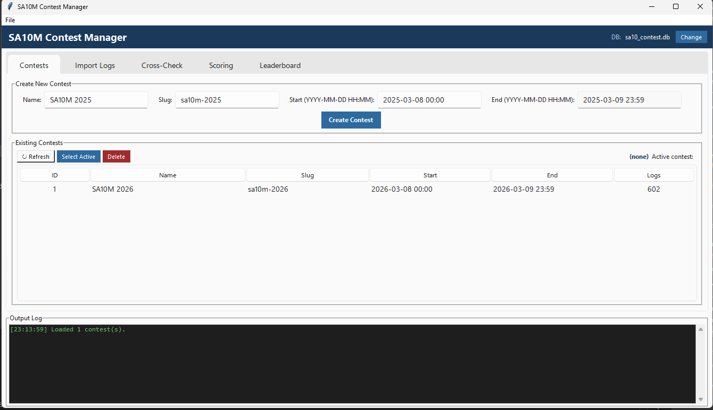

# Guía de Usuario — Aplicación de Escritorio

SA10M Contest Manager es una aplicación de escritorio construida con Python/Tkinter. Ofrece una interfaz con pestañas que guía al usuario a través del flujo de trabajo completo de puntuación del concurso.

---

## Estructura de la Aplicación



### Menú Archivo
- **Nueva Base de Datos…** — crea un archivo de base de datos vacío e inicializa todas las tablas (ver [Crear una Nueva Base de Datos](#crear-una-nueva-base-de-datos))
- **Abrir Base de Datos…** — abre un archivo de base de datos existente

### Barra de Encabezado
- Muestra la ruta del **archivo de base de datos activo** a la derecha
- El botón **Cambiar** abre un explorador de archivos para cambiar a una base de datos existente

### Log de Salida
- Consola deslizante en la parte inferior que captura toda la salida de operaciones
- Con código de color: blanco = normal, amarillo = advertencias, verde = éxito, rojo = errores
- **Limpiar Log** elimina todos los mensajes

### Barra de Estado
- Muestra el estado de la operación actual (Listo / Importando logs… / Calculando puntajes…)
- Barra de progreso animada mientras se ejecuta una tarea en segundo plano

---

## Flujo de Trabajo Recomendado

Sigue las pestañas en orden para una ejecución limpia del concurso:

```
1. Concursos  →  2. Importar Logs  →  3. Validación Cruzada  →  4. Puntuar  →  5. Tabla
```

| Paso | Pestaña | Qué ocurre |
|------|---------|-----------|
| 1 | [Concursos](concursos.md) | Crear el registro del concurso y establecerlo como activo |
| 2 | [Importar Logs](importar-logs.md) | Cargar archivos de log Cabrillo desde una carpeta |
| 3 | [Validación Cruzada](validacion-cruzada.md) | Validar contactos entre todos los logs (NIL / erróneos) |
| 4 | [Puntuar](puntuacion.md) | Calcular puntos y multiplicadores |
| 5 | [Tabla de Clasificación](tabla-clasificacion.md) | Navegar resultados, exportar a Excel o CSV |

---

---

## Crear una Nueva Base de Datos

Cada temporada de concurso (o cuando desees empezar desde cero) puedes crear una nueva base de datos vacía directamente desde la aplicación, sin necesidad de herramientas de línea de comandos.

1. Abre el menú **Archivo** → **Nueva Base de Datos…**
2. Elige una ubicación y nombre de archivo (p. ej. `sa10m_2026.db`) y haz clic en **Guardar**.
3. Si el archivo ya existe, se te pedirá confirmar la sobreescritura.
4. La base de datos se crea y todas las tablas se inicializan automáticamente.
5. La barra de encabezado se actualiza con la ruta de la nueva base de datos y la pestaña Concursos se recarga (vacía).

Ahora puedes crear un registro de concurso y comenzar a importar logs.

!!! tip "Una base de datos por año"
    Usar una base de datos separada para cada edición del concurso (p. ej. `sa10m_2025.db`, `sa10m_2026.db`) mantiene los datos aislados y facilita el archivado. Usa **Abrir Base de Datos…** para alternar entre ellas en cualquier momento.

---

## Iniciar la Aplicación

```bash
# Activar el entorno virtual primero
.venv\Scripts\activate        # Windows
source .venv/bin/activate     # Linux / Mac

# Iniciar
python app_ui.py
```
