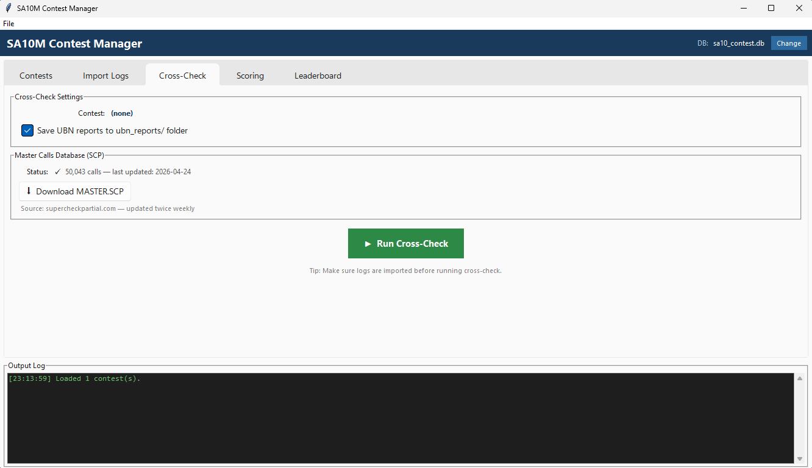

# Cross-Check Tab



The **Cross-Check** tab validates every contact in each submitted log against all other logs in the contest. It identifies three types of problems and writes UBN (Unique / Busted / Not-in-log) reports.

---

## How Cross-Checking Works

For each QSO in a log the system looks for a **matching contact** in the log of the other station:

| Result | Meaning |
|--------|---------|
| **Matched** | Both stations logged the QSO with consistent details |
| **NIL** (Not In Log) | The other station's log has no record of this contact |
| **Busted** | The callsign logged differs slightly from the actual callsign (likely a copy error) |
| **Unique** | The contact appears in only one log — could be a valid QSO with a non-submitting station |

---

## Master Calls Database (SCP)

The Super Check Partial (SCP) database is a large list of known active callsigns. It is used to validate whether a logged callsign is a real, recognized call.

### SCP Status indicator

The status line shows:

- `⚠ Not downloaded yet` — the file is missing
- `✓ 215,000 calls — last updated: 2026-03-10` — file is present with call count and date

### Downloading MASTER.SCP

Click **⬇ Download MASTER.SCP** to fetch the latest file from [supercheckpartial.com](https://www.supercheckpartial.com). The file is saved to `config/master.scp`. It is updated twice weekly by the SCP team.

!!! note
    An internet connection is required for the download. The cross-check will still run without the SCP file, but callsign validation against the known-calls database will be skipped.

---

## Settings

| Option | Description |
|--------|-------------|
| **Contest** | Displays the currently active contest (read-only) |
| **Save UBN reports to ubn_reports/ folder** | When checked, a text report is written for each log that has NIL or busted entries |

---

## Running the Cross-Check

Click **▶ Run Cross-Check**. The operation runs in a background thread.

### Output example

```
Cross-check complete in 12.4s — 487 logs with issues.
```

### UBN Reports

When "Save UBN reports" is enabled, one `.txt` file is created per affected log in the `ubn_reports/` directory. Each report lists:

- The log's callsign and contest
- Total contacts vs. valid contacts
- Individual NIL and busted entries with details

See [UBN Report Format](../UBN_REPORT_FORMAT.md) for the full specification.

---

## After Cross-Check

Cross-check results are stored back in the `contacts` table (each contact is flagged as valid, NIL, or busted). These flags are then used by the **Scoring** engine to exclude invalid contacts from the score.

Proceed to the **Scoring** tab.

!!! tip
    You can re-run the cross-check at any time. Each run overwrites the previous results.
