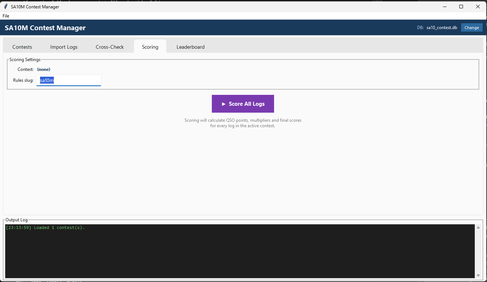

# Scoring Tab



The **Scoring** tab calculates QSO points and multipliers for every log in the active contest and stores the results in the database.

---

## Settings

| Field | Description |
|-------|-------------|
| **Contest** | Active contest name (read-only — set in the Contests tab) |
| **Rules slug** | Identifier for the contest rules YAML file in `config/contests/`. Default: `sa10m` |

The rules slug maps to a file such as `config/contests/sa10m.yaml` which defines point values, multiplier types, valid bands, and exchange requirements.

---

## Running the Scorer

Click **▶ Score All Logs**. The scorer processes every log in the active contest sequentially.

### Progress output

```
Scoring 601 logs…
  Progress: 50/601  (50 OK, 0 errors)
  Progress: 100/601  (100 OK, 0 errors)
  ...
Scoring complete — 601 OK, 0 errors.
```

Any log that fails to score (e.g., malformed data) is counted as an error and reported in yellow, but processing continues for the remaining logs.

---

## What Gets Calculated

For each log the scoring engine:

1. **Filters contacts** — only contacts marked as valid after cross-check are counted
2. **Calculates QSO points** — applies the SA10M point table based on operator location and contact type (see [SA10M Quick Reference](../SA10M_QUICK_REFERENCE.md))
3. **Counts WPX prefixes** — unique callsign prefixes worked across the entire contest
4. **Counts CQ zones per band** — unique CQ zones worked on each band
5. **Calculates band score** — `QSO Points × (WPX Prefixes + CQ Zones on that band)`
6. **Sums all band scores** — for SA10M this is a single-band total

The results are stored in the `scores` table and immediately available in the **Leaderboard** tab.

---

## Rescoring

You can re-run scoring at any time. Each run overwrites the previous scores. This is useful if you:

- Re-imported logs after finding an error
- Re-ran the cross-check with updated data
- Changed the contest rules

!!! note "Cross-check first"
    For accurate results, always run the cross-check before scoring. Scoring without a cross-check will count all contacts as valid, including NILs.
